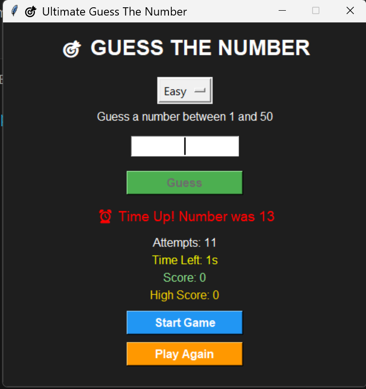
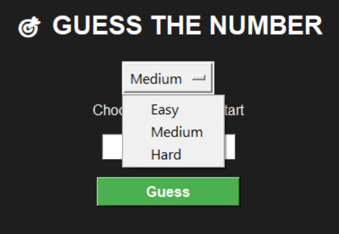
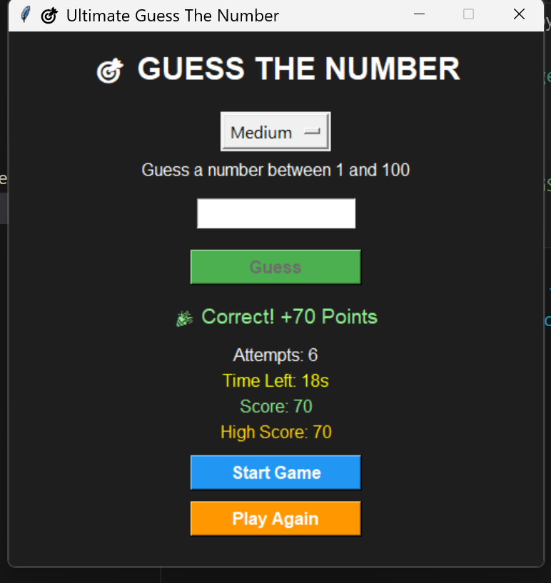

# 🎯 Number Guessing Game

<div align="center">


### A GUI-based Number Guessing Game built with Python and Tkinter

</div>

---

## 📌 About the Project

The Number Guessing Game is a desktop GUI application developed using Python and Tkinter. The game generates a random number, and the player must guess it within a limited number of attempts and time.

The game includes multiple difficulty levels, a scoring system, a timer, and high-score tracking to make gameplay more engaging and interactive.

---

## ✨ Features

* 🎮 Interactive GUI
* 🎯 Random Number Generation
* 📈 Too High / Too Low Hints
* ⏱️ Countdown Timer
* 🏆 Score System
* ⭐ High Score Tracking
* 🔄 Play Again Option
* 🌙 Dark Theme Interface
* ⌨️ Enter Key Support
* 🎚️ Multiple Difficulty Levels

---

## 📸 Screenshots

<table align="center">
<tr>
<td align="center">
<br>
<b>🏠 Home Screen</b>
</td>

<td align="center">
<br>
<b>🎮 Gameplay</b>
</td>
</tr>

<tr>
<td colspan="2" align="center">
<br>
<br>
<b>🏆 Winning Screen</b>
</td>
</tr>
</table>

---

## 🛠️ Technologies Used

| Technology    | Purpose                   |
| ------------- | ------------------------- |
| Python        | Core Programming Language |
| Tkinter       | GUI Development           |
| Random Module | Random Number Generation  |
| File Handling | High Score Storage        |
| Git           | Version Control           |
| GitHub        | Project Hosting           |

---

## 🚀 Installation

### Clone the Repository

```bash
git clone https://github.com/Muntaziralam143/NumberGuessingGame.git
```

### Navigate to the Project Directory

```bash
cd NumberGuessingGame
```

### Run the Application

```bash
python guess_game.py
```

---

## 🎮 How to Play

1. Launch the game.
2. Select a difficulty level.
3. Click **Start Game**.
4. Enter your guess.
5. The game will provide hints:

   * 📉 Too Low
   * 📈 Too High
6. Guess the correct number before the timer expires.
7. Earn points and try to beat your high score.

---

## 📂 Project Structure

```text
NumberGuessingGame/
│
├── guess_game.py
├── highscore.txt
├── README.md
│
└── screenshots/
    ├── home.png
    ├── gameplay.png
    └── win.png
```

---

## 📚 Learning Outcomes

This project helped me improve my understanding of:

* Python Programming
* GUI Development with Tkinter
* Event-Driven Programming
* Functions and Variables
* File Handling
* Git and GitHub Workflow
* Project Documentation

---

## 🔮 Future Improvements

* 🔊 Sound Effects
* 🎵 Background Music
* 🏅 Global Leaderboard
* 🗄️ SQLite Database Integration
* 👤 Multiple Player Profiles
* 📱 Mobile Version
* 🎨 Improved UI & Animations

---

## 👨‍💻 Author

### Muntazir Alam

GitHub: https://github.com/Muntaziralam143

---

<div align="center">

⭐ If you like this project, consider giving it a star!

</div>
